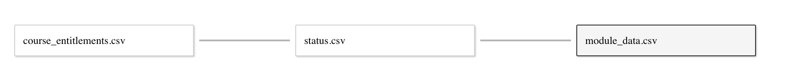

# Module Progress

Module Progress is a Python script and Tableau workbook for visualizing students progress in a Canvas course. The script component gathers, cleans and exports data from the [Canvas LMS REST API](https://canvas.instructure.com/doc/api/index.html). This data can then be imported into Tableau and explored using a collection of interactive dashboards.

> Demo Dashboard [link](https://public.tableau.com/profile/marko1654#!/vizhome/ModuleProgress/StartHereOverallStatus)

## Environment Setup

- Create a file called `.env` in the ROOT folder with the following fields:

  ```
  CANVAS_API_TOKEN =  # paste your personal token here
  ```

- install environment using [Conda](https://docs.conda.io/en/latest/)

  `$ conda env create -f environment.yml`

  `$ conda activate module-progress`

## Specifying Courses and User Filters

The script will need to know which courses to query. In the file titled `course_entitlements.csv`, ensure there is a `course_id` column and list all target course id's in that column _(Note you'll need to have the proper Canvas privledges to get the data)_.

You can add a optional `user_id` column as well if working with Tableau Server. Here, you can list Tableau Server user id's to make certain course data be visible to certain users.

*If you are not planning to use user filtering, you may delete the entire user_id column*

For example:

| course_id     | user_id       |
|:-------------:|:-------------:|
| 12345         | foo           |
| 54321         | foo           |
| 54321         | bar           |
| 67890         | bar           |

> In the above example user **foo** will be able to see course 12345 and user **bar** will be able to see course 67890. Both will be able to see course 54321. Note that the same course id listed multiple times will not duplicate data.

Read more about Tableau user filters [here](https://help.tableau.com/current/pro/desktop/en-us/publish_userfilters_create.htm)

## Running the Script

- Open terminal and navigate to project ROOT directory
- Start the Conda environment: `conda activate module-progress`
- Run the script: `python main.py`
- Wait for script to finish and print table to console. Evaluate the printed output and ensure necessary courses have completed successfully. If a course fails, error messages will provide info about what went wrong.
- All courses that completed successfully will have a directory titled by course id in the /data folder with 4 CSV files inside
- The directory: `data/Tableau` will contain all the necessary files for linking to Tableau including:
  - module_data.csv: A table containing a union of data for all successfully queried courses
  - status.csv: A table that reflect the status of the most recent run. For each course shows the state of the query (Success or Failed), date and time of last run and any error/success messages.

## Connecting to Tableau

When you first open **module-progress.twb** you should use the sample data provided in the `/SAMPLE_Tableau_Data` directory. Follow the instructions under the **Without User Filters** section to import the data. Ensure that all the dashboards show sample data before applying custom data. We recommend getting familiar with the different views with the smaller sample dataset before jumping into larger dataset.


To work with non-sample data (output from script), open **module-progress.twb** and navigate to _Data Source_ tab

### With User Filters

- Create a connection with one of the CSV files in the `data/Tableau` directory. 
- Create a connection with `course_entitlements.csv`
- Define relationship between tables on *Course ID* as such:
  
- Sign in to Tableau Server to enable filtering to your specifications in `course_entitlements.csv`
- Go to any sheet within the dashboards and apply the calculated field "User Filter" in "Filters" (select only those that are "True") - apply this filter to all sheets using the dataset when prompted
  > Note this calculated field matches your Tableau username to the "User Id's" specified in `course_entitlements.csv` and will filter out any courses that aren't associated with that username.


## Without User Filters

- Connect the `module_data.csv` and `status.csv` data sources to Tableau and define their relationship as such:
  
- The two tables should be linked via *Course ID*

When the data sources has been connected. The _Overall Status_ dashboard provides a dropdown where courses can be selected for the visualization by Course Name (only one course can be selected at a time)

## Project Structure

`/src`: Python files with all the logic for gathering data from Canvas and outputting CSV tables to `/data`.

`/data`: Holds the data outputted by the script. Output data will be organized into folders titled after the Canvas course id. Tables will be located in this directory in CSV files.

`/data/Tableau`: contains **status.csv** and **module_data.csv** which detail run status and course data respectively. These three CSV's get imported into Tableau.

`/status_log`: Folder containing CSV log files (one per run). Log files will show the status (success or failed) of fetching data for each course specified in **course_entitlements.csv**.

`archive`: At the beginning of each run, the contents of `/data` get zipped and stored in this folder.

`.env`: _Created manually_. Where user sets their Canvas API Token.

`module_progress.twbx`: Tableau workbook containing dashboards to visualize the data output. This packaged workbook also includes mock data.

`course_entitlements.csv`: Where courses are specified (by Canvas course id). Must list course ids under a column titled "course_id". Optional "user_id" column if using Tableau Server & User Filters.

`environment.yml`: Conda environment file.
