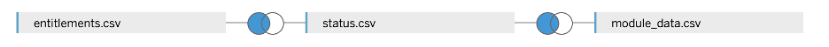

# Module Progress

Module Progress is a Python script and Tableau workbook for visualizing students progress in a Canvas course. The script component gathers, cleans and exports data from the Canvas LMS REST API. This data can then be imported into Tableau and explored using a collection of interactive dashboards.

## Setup

- Create a file title `.env` in the src folder with the following fields:

  ```
  CANVAS_API_TOKEN =
  CANVAS_API_TOKEN_TEST =
  CANVAS_API_TOKEN_SANDBOX =
  ```

  > asign your Canvas token to the CANVAS_API_TOKEN variable (or one of the following variables if using test or sandbox instances of Canvas)

- paste all the course ids you wish to be included in the data output under the `course_id` column in **courses.csv**

- install environment using [Conda](https://docs.conda.io/en/latest/)

  `$ conda env create -f environment.yml`

  `$ conda activate module_progress_env`

## Running the Script

- Open terminal/command line and navigate to project ROOT directory
- Start the Conda environment: `conda activate module_progress_env`
- Run the script: `python src/get_module_progress.py`
- Wait for script to finish and print table to console. Evaluate the results and ensure necessary courses have completed successfully. If a course fails, error messages will provide info about what went wrong.
- All courses that completed successfully will have a directory titled by course id in the /data folder with 4 CSV files inside
- The directory: `data/Tableau` will contain all the necessary files for linking to Tableau including:
  - module_data.csv: A table containing a union of data for all successfully queried courses
  - status.csv: A table that reflect the status of the most recent run. For each course shows the state of the query (Success or Failed), date and time of last run and any error/success messages.

## Connecting to Tableau

- Open **module_progress.twbx** and navigate to _Data Source_ tab
- Create a connection with one of the CSV files in the `data/Tableau` directory. Perform a series of left joins over the data the reflects the structure below:
  
- The _Overall Status_ dashboard provides a dropdown where courses can be selected for the visualization by Course Name (only one course can be selected at a time)

## Project Structure

`/src`: Python files with all the logic for gathering data from Canvas and outputting CSV tables to `/data`.

`/data`: Holds the data outputted by the script. Output data will be organized into folders titled after the Canvas course id. Tables will be located in this directory in CSV files.

`/data/Tableau`: contains **status.csv** and **module_data.csv** which detail run status and course data respectively. These three CSV's get imported into Tableau.

`/status_log`: Folder containing CSV log files (one per run). Log files will show the status (success or failed) of fetching data for each course specified in **courses.csv**.

`archive`: At the beginning of each run, the contents of `/data` get zipped and stored in this folder.

`.env`: _Created manually_. Contains three variables where users can add their Canvas tokens.

`module_progress.twbx`: Tableau workbook containing dashboards to visualize the data output. This packaged workbook also includes mock data.

`courses.csv`: Where courses are specified (by Canvas course id). Must list course ids under a column titled "course_id".

`environment.yml`: Conda environment file.
